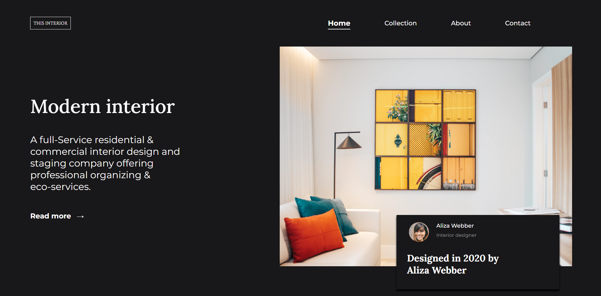
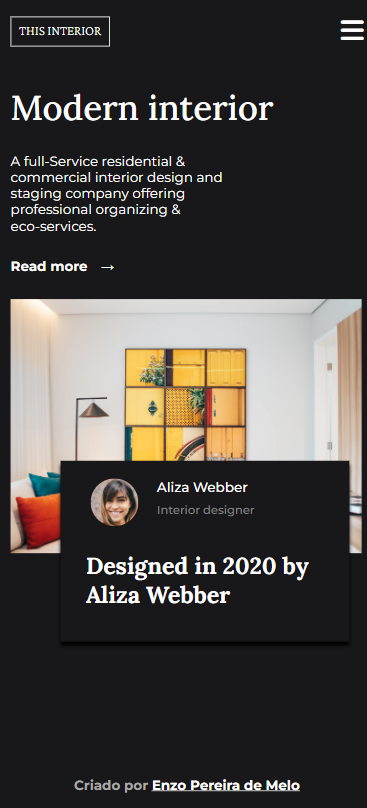
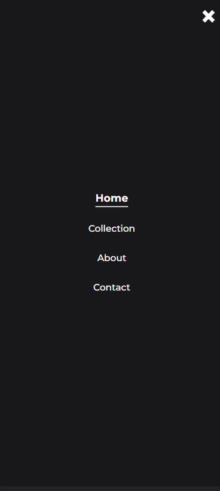

Nesse projeto fiz um site responsivo para um consultor de design interior de casa. Em desktops, todos os links ficam visíveis, mas em smartphones, há um ícone de menu para mostrar e ocultar links. É minha primeira experiência com isso, então fiquei muito satisfeito com o resultado. Que venham mais conhecimentos!

- Link para acessar o site online: 

<!-- Sumário -->

## Sumário

- [Visualização](#vizualização)
  - [Tecnologias](#tecnologias)
- [Contato](#contato)

<!-- First view -->

## Visualização

### Tecnologias

- HTML
- CSS
- JavaScript

## Contato

- GitHub [@enzopdm](https://github.com/enzopdm)
- LinkedIn [@EnzoPereira](https://www.linkedin.com/in/enzo-pereira-a5001a221/)